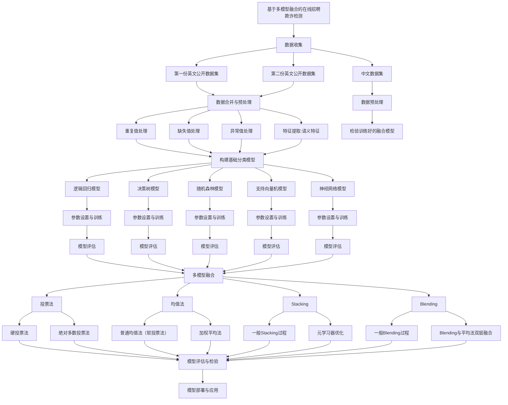

## 数据分析

### 数据源分析

本项目的数据集来源于公开数据集[fake-job-postings](https://www.kaggle.com/datasets/shivamb/real-or-fake-fake-jobposting-prediction) 与[FakePostings](https://www.kaggle.com/datasets/srisaisuhassanisetty/fake-job-postings)与https://github.com/freekatz/ORFD/blob/master/orfd/Core/dataset/origin.csv ，即本项目的数据集来源于两份数据集，分别为 fake-job-postings 和 FakePostings。为了便于区分，本研究将其分别命名为 the first dataset 与 the second dataset。

#### The First Dataset

此数据集来自公开数据集 FakePostings, 它包含了一系列在线招聘广告的文本数据，这份数据集包含 10000 条虚假招聘信息的精选列表。该数据集主要用于研究欺诈性招聘模式和诈骗策略，通过分析职位描述、公司信息、薪资待遇等特征，来判别广告的真实性。字段及描述如下表所示：

| 字段            | 有效值数量 | 缺失值 | 缺失值比率 | 数据类型 | 变量类型   |
| --------------- | ---------- | ------ | ---------- | -------- | ---------- |
| title           | 10000      | 0      | 0          | String   | 文本型     |
| description     | 10000      | 0      | 0          | String   | 文本型     |
| requirements    | 10000      | 0      | 0          | String   | 文本型     |
| company profile | 10000      | 0      | 0          | String   | 文本型     |
| location        | 10000      | 0      | 0          | String   | 分类型     |
| salary range    | 10000      | 0      | 0          | String   | 离散定量型 |
| employment type | 10000      | 0      | 0          | String   | 分类型     |
| industry        | 10000      | 0      | 0          | String   | 有序分类型 |
| benefits        | 10000      | 0      | 0          | String   | 文本型     |
| fraudulent      | 10000      | 0      | 0          | int      | 二元型     |

#### The Second Dataset

此数据集来源于公开数据集 EMSCAD，该数据集包含 17880 份在线招聘广告，其中约 800 份是虚假的，数据包括有关职位的文本信息和元信息，可以识别本质上具有欺诈性的职位描述的关键特征和特性，或创建分类模型来预测哪些职位描述是虚假的或真实的。属性及描述信息如下表所示：

| 字段                | 有效值 | 缺失值 | 缺失值比率 | 数据类型 | 变量类型   |
| ------------------- | ------ | ------ | ---------- | -------- | ---------- |
| job id              | 17880  | 0      | 0          | int      | 离散型     |
| title               | 17880  | 0      | 0          | String   | 文本型     |
| location            | 17534  | 346    | 0.0194     | String   | 分类型     |
| department          | 6333   | 11537  | 0.6458     | String   | 分类型     |
| salary range        | 2868   | 15012  | 0.8396     | String   | 离散定量型 |
| company profile     | 14572  | 3308   | 0.1850     | String   | 文本型     |
| description         | 17879  | 1      | 0.0001     | String   | 文本型     |
| requirements        | 15184  | 2696   | 0.1508     | String   | 文本型     |
| benefits            | 10668  | 7212   | 0.4034     | String   | 文本型     |
| telecommuting       | 17880  | 0      | 0          | int      | 二元型     |
| has company logo    | 17880  | 0      | 0          | int      | 二元型     |
| has questions       | 17880  | 0      | 0          | int      | 二元型     |
| employment type     | 14409  | 3471   | 0.1941     | String   | 分类型     |
| required experience | 10830  | 7050   | 0.3943     | String   | 有序分类型 |
| required education  | 9775   | 8105   | 0.4533     | String   | 有序分类型 |
| industry            | 12997  | 4903   | 0.2743     | String   | 分类型     |
| function            | 11425  | 6455   | 0.3610     | String   | 分类型     |
| fraudulent          | 17880  | 0      | 0          | int      | 二元型     |

### 数据合并

在合并和清理这两个数据集的过程中，我们首先需要确保每个字段的数据一致性，且在合并后不会丢失关键信息

```python
df = pd.concat([df1, df2], axis=0)
del df["job_id"] # 删除job_id这一列
print(f"数据集的形状为:{df.shape}")
df.to_feather(PROCESSED_DATA_DIR / "combined_data.feather") # 保存数据
df.sample(n=1, random_state=42)
```


