# 在线招聘欺诈检测

[](https://github.com/ZenCoder-art/ofd/blob/main/LICENSE)
[](https://www.python.org/)

This is my code repository for my thesis project, which is titled "Detecting Online Recruitment Fraud Using Model Fusion Techniques".

文档说明：[https://zencoder-art.github.io/ofd/](https://zencoder-art.github.io/ofd/)

## 项目简介

本项目旨在利用模型融合技术，对在线招聘欺诈进行检测。通过对大量的招聘广告进行分析，我们可以发现招聘广告中存在着大量的虚假信息，这些虚假信息可能会误导招聘者，从而影响招聘者的招聘决策。因此，我们需要开发一种有效的方法来检测招聘广告中的虚假信息，从而提高招聘的准确性和可信度。

## 数据源分析

本项目的数据集来源于公开数据集[fake-job-postings](https://www.kaggle.com/datasets/shivamb/real-or-fake-fake-jobposting-prediction)、[FakePostings](https://www.kaggle.com/datasets/srisaisuhassanisetty/fake-job-postings)与[origin.csv](https://github.com/freekatz/ORFD/blob/master/orfd/Core/dataset/origin.csv)

## 工具与技术

### 后端

- 语言: Python 3.10+
- 数据处理: pandas, numpy, jieba
- 可视化: matplotlib, seaborn, scienceplots
- 机器学习: scikit-learn
- 后端部署: FastAPI, Uvicorn
- 模型融合: Voting, Stacking

### 其他工具

- mermaid
- VSCode
- Jupyter NoteBook

## 项目结构

```text
ofd/
├── backend/              # ✅ FastAPI 后端服务代码
│   ├── main.py           # FastAPI 启动入口
│   ├── notebooks         # 模型训练笔记本
│   └── app               # 应用层
│       ├── api           # API 层
│       ├── models        # 模型层
│       ├── schemas       # 数据模型
│       └── utils         # 工具类
|       └── service       # 服务层
|       └── config.py     # 应用配置
│
├── frontend/             # ✅ 前端页面(目前只用vue做了脚手架，待完善)
│
├── docs/                 # ✅ 项目文档（使用 Docsify）
├── paper/                # ✅ 论文或研究报告相关材料
├── LICENSE               # 📄 开源协议（MIT）
├── README.md             # 📘 项目说明文档
├── .gitignore            # 🚫 Git 忽略规则
└── .gitattributes        # ⚙️ Git 属性配置
```

## 🔍 技术流程图

```mermaid
graph TB;
    A[基于多模型融合的在线招聘欺诈检测] --> B[数据收集];
    B --> C1[第一份英文公开数据集];
    B --> C2[第二份英文公开数据集]
    C1 --> D[数据合并与预处理]
    C2 --> D[数据合并与预处理]
    D --> E1[重复值处理]
    D --> E2[缺失值处理]
    D --> E3[异常值处理]
    D --> E4[特征提取:语义特征]
    E1 --> F[构建基础分类模型]
    E2 --> F
    E3 --> F
    E4 --> F
    F --> G1[逻辑回归模型]
    F --> G2[决策树模型]
    F --> G3[随机森林模型]
    F --> G4[支持向量机模型]
    F --> G5[神经网络模型];
    G1 --> H1[参数设置与训练]
    H1 --> J1[模型评估]
    G2 --> H2[参数设置与训练]
    H2 --> J2[模型评估]
    G3 --> H3[参数设置与训练]
    H3 --> J3[模型评估]
    G4 --> H4[参数设置与训练]
    H4 --> J4[模型评估]
    G5 --> H5[参数设置与训练]
    H5 --> J5[模型评估]
    J1 --> K[模型融合]
    J2 --> K
    J3 --> K
    J4 --> K
    J5 --> K
    K --> L1[投票法]
    K --> L2[均值法]
    K --> L3[Stacking]
    K --> L4[Blending]
    L1 --> M1[硬投票法]
    L1 --> M2[绝对多数投票法]
    L2 --> M3[普通均值法（软投票法）]
    L2 --> M4[加权平均法]
    L3 --> M5[一般Stacking过程]
    L3 --> M6[元学习器优化]
    L4 --> M7[一般Blending过程]
    L4 --> M8[Blending与平均法双层融合]
    M1 --> N[模型评估与检验]
    M2 --> N
    M3 --> N
    M4 --> N
    M5 --> N
    M6 --> N
    M7 --> N
    M8 --> N
    N --> O[模型部署与应用]
    B --> C3[中文数据集]
    C3 --> D1[数据预处理]
    D1 --> E5[检验训练好的融合模型]
```



## 📄LICENSE

本项目采用[MIT License](https://github.com/ZenCoder-art/ofd?tab=MIT-1-ov-file)
