# 基于模型融合的在线招聘欺诈检测

## 技术路线图

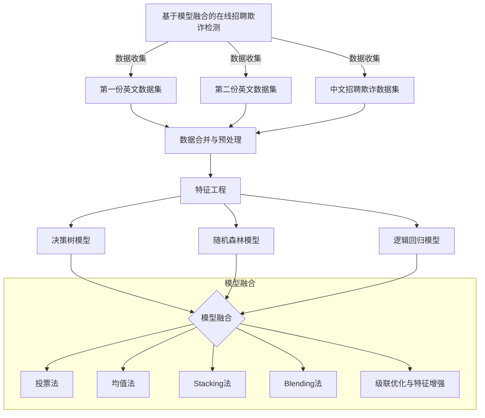

## Bagging 算法流程图

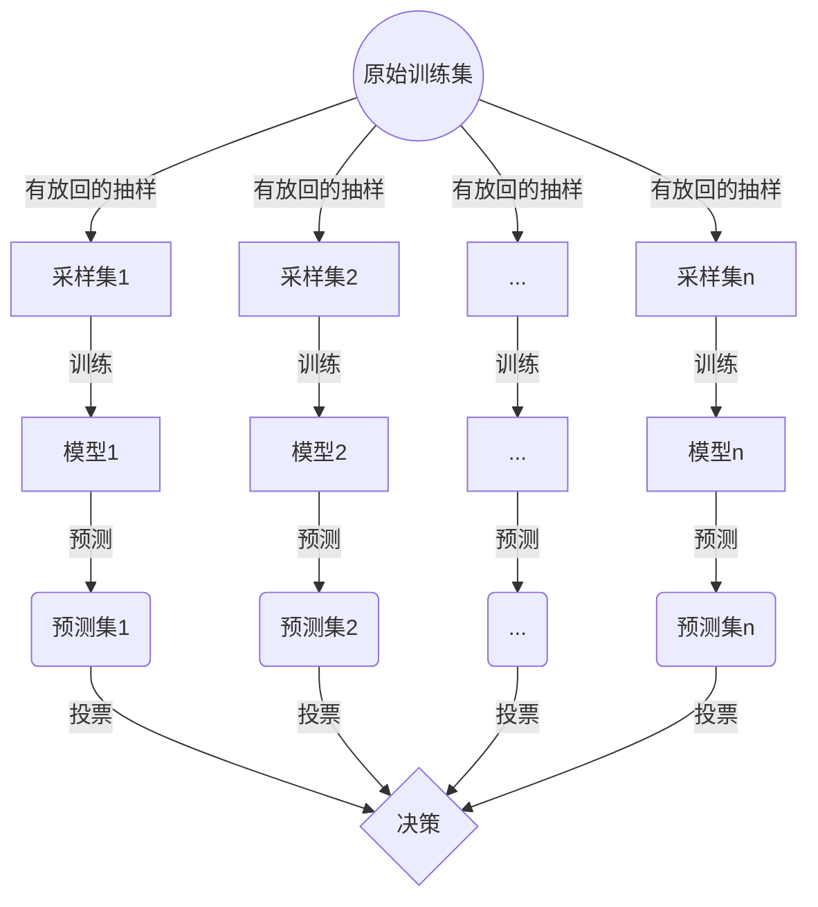

## Boosting 算法流程图

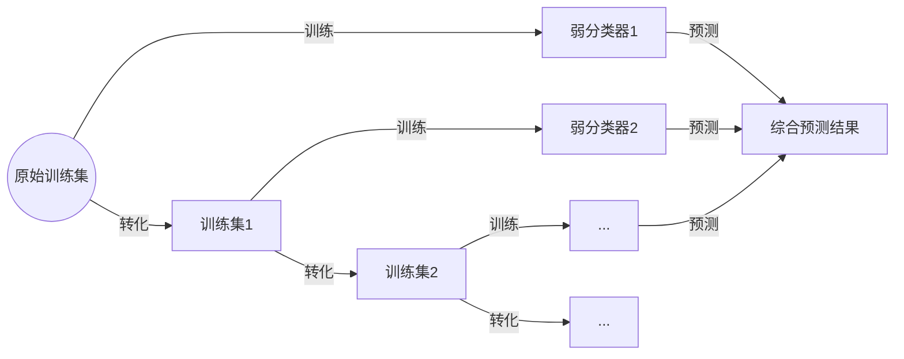

## Stacking 模型融合算法流程图

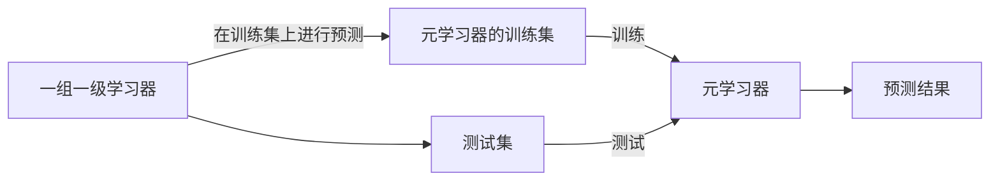

## Blending 模型融合算法流程图

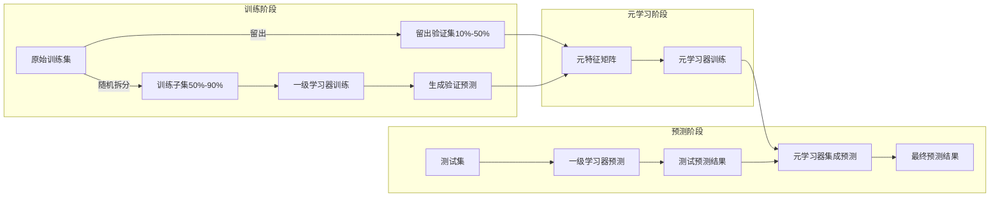

## 异常值处理算法流程

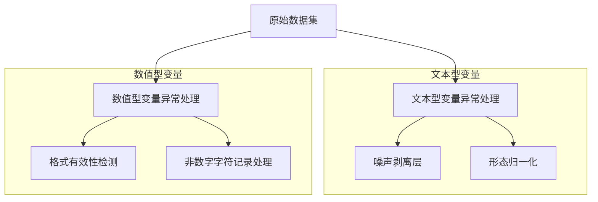

## 决策树示例图

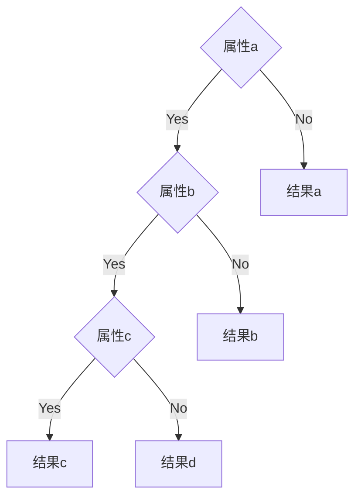

## ColumnTransformer 示例图

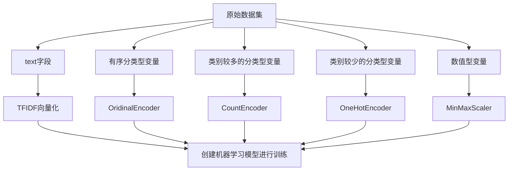

## 模型融合框架图

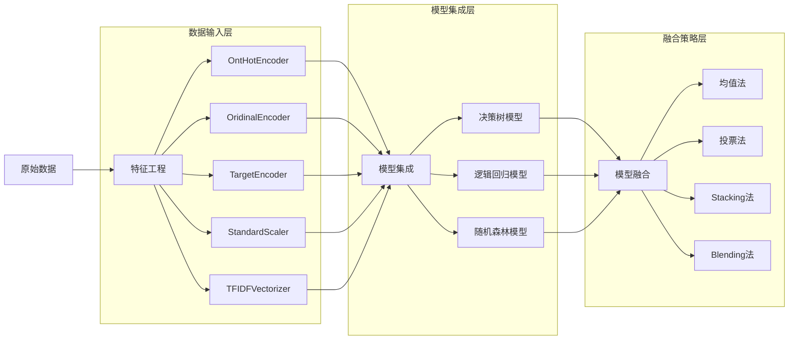

## 数据预处理流程图

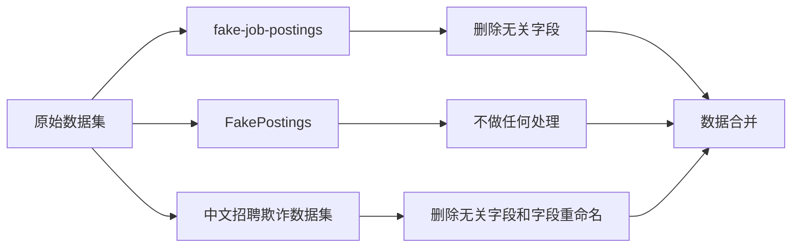

## 重复值

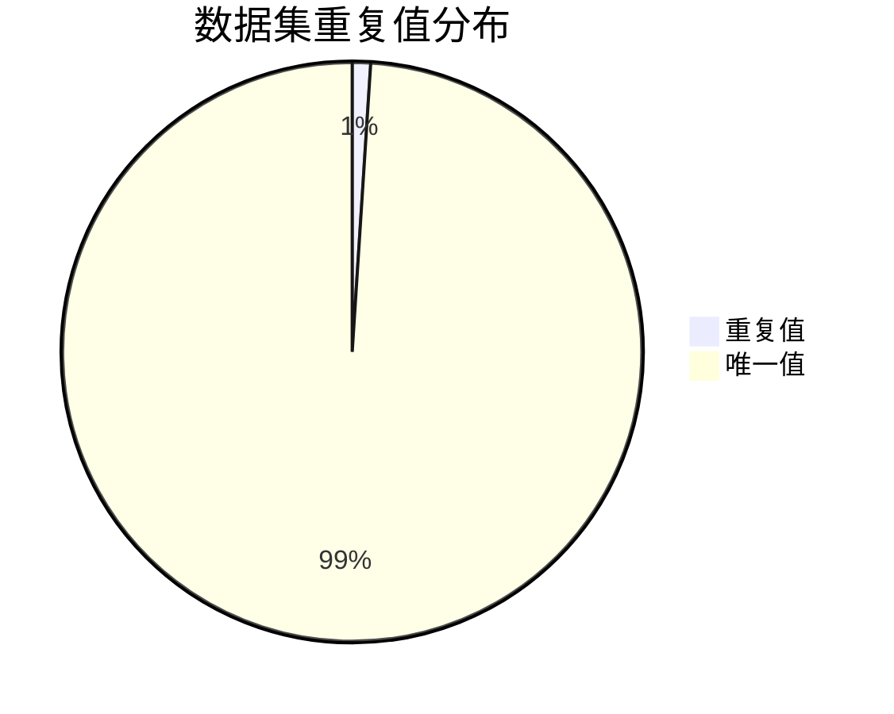

## 缺失值处理流程

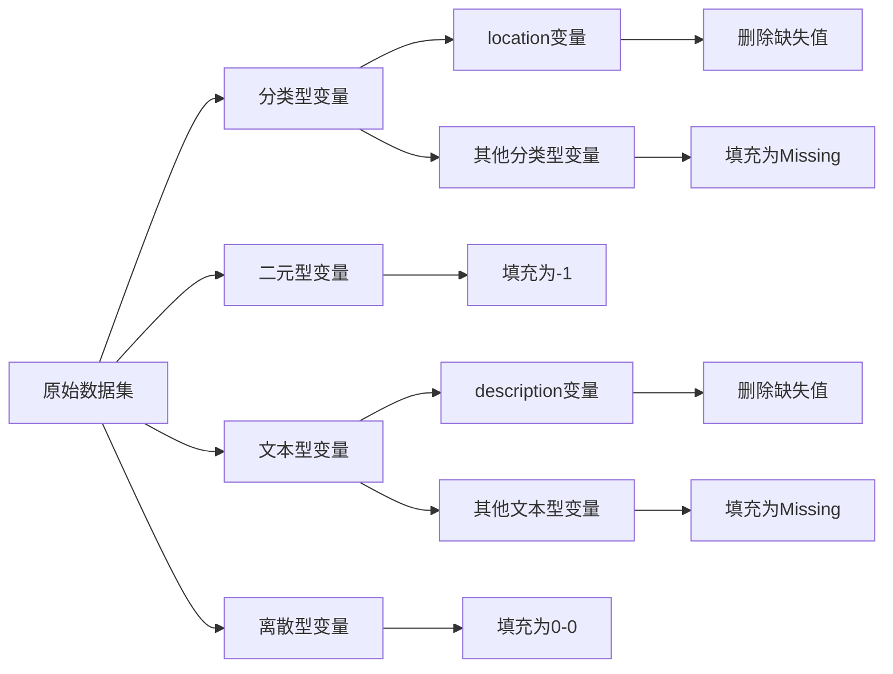

## 混淆矩阵示例图

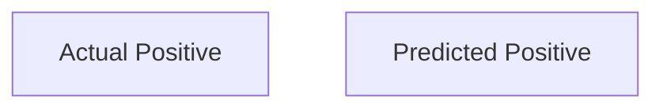

## 模型权重占比图

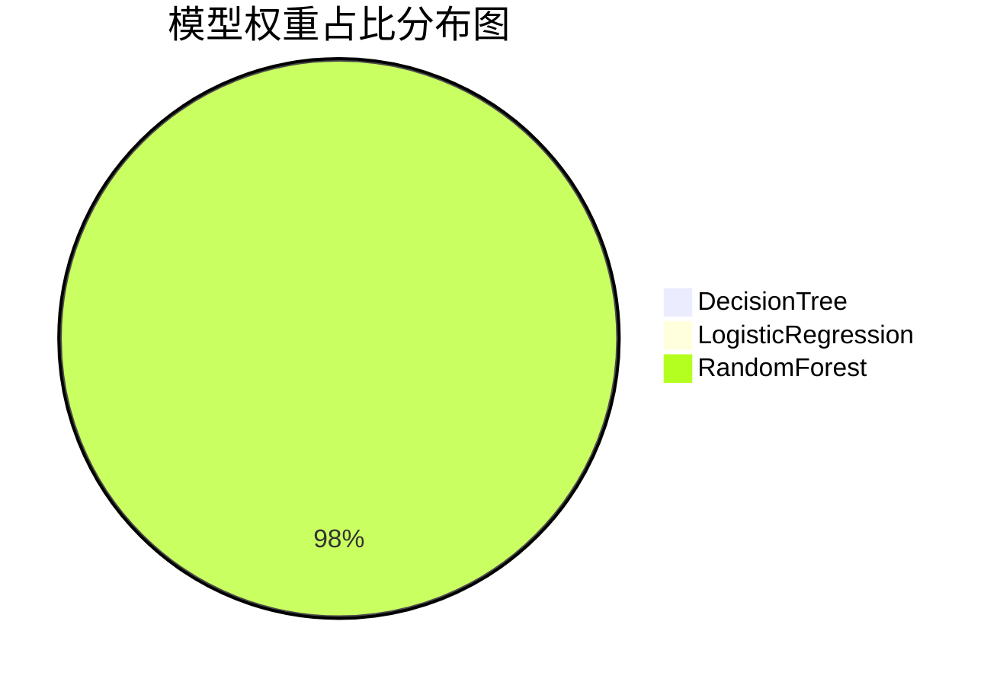

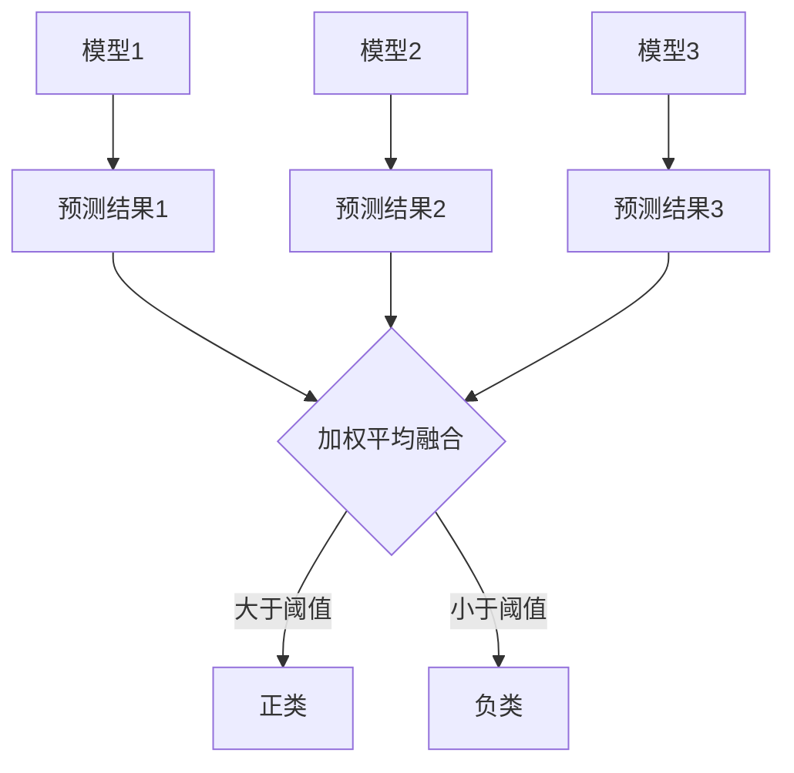

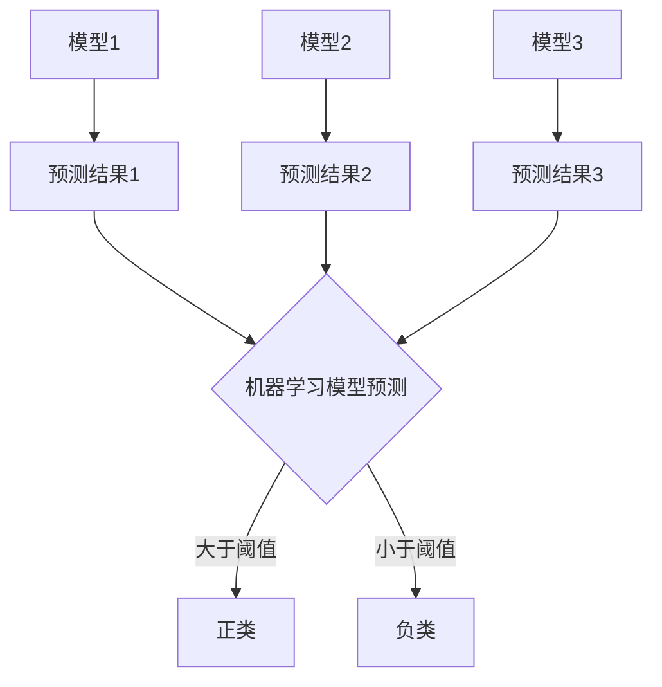

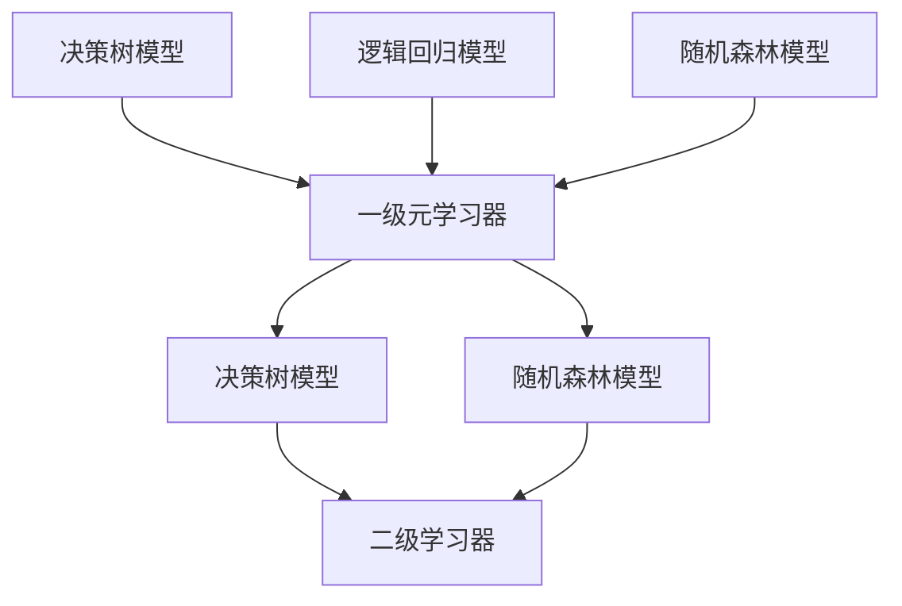

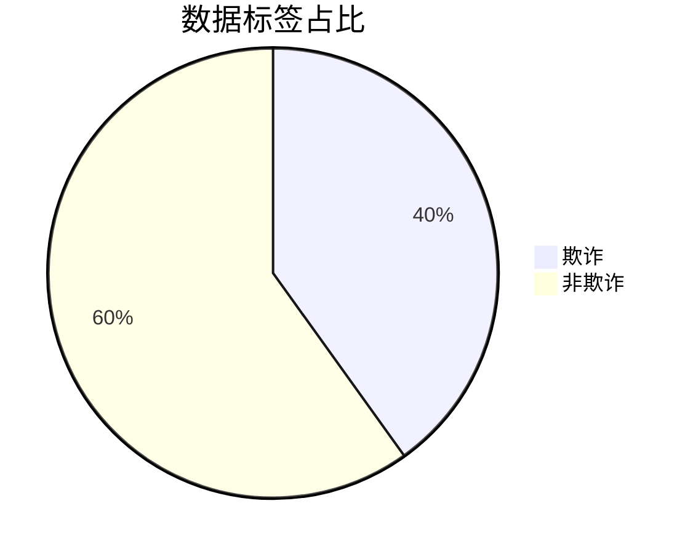